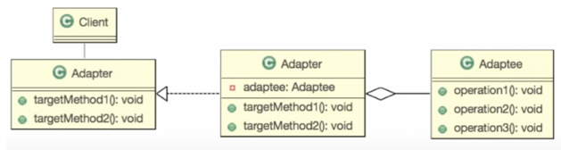

> 어떠한 알고리즘을 바로 사용할 수가 없을 때 이를 요구사항에 맞춰 사용하기위해 사용.





```java
public class Math {
    public static double twoTime (double num){return num*2;}
    public static double half (double num){return num/2;}
}
```

원래의 알고리즘을 건드리지 않고 새로운 변형된 알고리즘을 이용.

```java
public interface Adapter {
    float twiceOf(float f);
    float halfOf(float f);
}

public class AdapterImpl implements Adapter {
    @Override
    public float twiceOf(float f) {
        return (float)Math.twoTime((double) f);
    }

    @Override
    public float halfOf(float f) {
        return (float)Math.twoTime((double) f);

    }

}
```
:: double을 인수로 받는 메서드를 float로 받아 사용할 수 있도록 변경함.