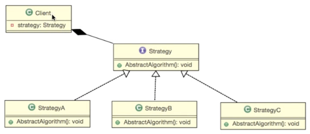

> 여러 알고리즘을 하나의 추상적인 접근점(인터페이스)을 만들어 접근 점에서 서로 교환 가능하도록 하는 패턴




- Strategy

```java
interface Weapon {
    void attack();
}

public class Knife implements Weapon {
    public void attack(){
        System.out.println("Knife Attack");
    }
}

public class Sword implements Weapon{
    public void attack(){
        System.out.println("Sword Attack");
    }
}

public class Gun implements Weapon{
    public void attack(){
        System.out.println("Gun Attack");
    }
}

```

- Client

```java
public class GameCharacter {
        //접근점
    Weapon weapon = null;
        
        //교환 가능
    public void setWeapon(Weapon weapon){
        this.weapon = weapon;
    }
        
        //델리게이트: attack 의 동작에 대해서는 알지못해도 됨.
    public void attack(){
        if (weapon ==null)
            System.out.println("Hand Attack");
        else{
            weapon.attack();
        }
    }
}
```


```java
public class GameTest {
    public static void main(String[] args) {
        GameCharacter gameCharacter = new GameCharacter();
        gameCharacter.setWeapon(new Gun());

        gameCharacter.attack();
				

    }
}
```
:: client는 어떻게 동작하는지 몰라도, 유연하게 변경하여 사용이 가능함.