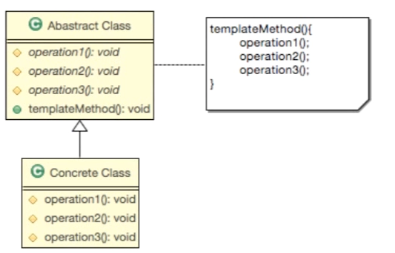

> 알고리즘의 구조를 메소드에 정의 하고, 하위클래스에서 알고리즘 구조의 변경없이 알고리즘을 재정의하는 패턴.

- ### 언제 사용하는가?
  
        - 구현 하려는 알고리즘이 일정한 프로세스가 있다.
        - 구현하려는 알고리즘이 변경 가능성이 있다.


## 구현
******
1. 알고리즘을 여러 단계로 나눈다.
2. 나눠진 알고리즘의 단계를 메소드로 선언한다.
3. 알고리즘을 수행할 템플릿 메소드를 만든다.
4. 하위 클래스에서 나눠진 메소드들을 구현한다.

```java
public abstract class GameConnection {
    protected abstract String Security(String String);
    protected abstract boolean authentication(String id, String password);
    protected abstract int authorization(String userName);
    protected abstract String connection(String info);

    public String requestConnection(String encodedInfo){
        String decodedInfo = Security(encodedInfo);
        String id = "id";
        String password = "pass";
        String userName = "kim";
        boolean isExist =  authentication(id, password);
        if(! isExist)
           throw new Error("존재하지 않는 회원.");

        int i = authorization(userName);
        switch (i){
            case 0:
                //매니저
                break;
            case 1:
                //정회원
                break;
            case 2:
                //준회원
                break;
        }
        return connection(decodedInfo);
    }
}
```

:: 추상 클래스에 각 처리 단계를 메서드로 선하고 이를 순차적으로 실행하는 메서드를 만든다.    
외부에서는 requestConnection을 제외한 메서드에는 접근이 불가능해야하기 때문에 protected로 선언해주었다.

```java
public class DefaultGameConnection  extends GameConnection{

    @Override
    protected String Security(String encodedStr) {
        String decodedStr = encodedStr; //decode 처
        System.out.println("보안 확인");
        return decodedStr;
    }
    @Override
    protected boolean authentication(String id, String password) {
        System.out.println("회원 확인");
        return true;
    }
    @Override
    protected int authorization(String userName) {
        System.out.println("권한 확인");
        return 0;
    }
    @Override
    protected String connection(String info) {
        System.out.println("연결");
        return info;
    }
}
```
:: 하위 클래스에서 추상클래스를 상속하여 메서드를 구현한다.

## 장단점
*****


### 👍장점 
> - 중복 코드를 줄일 수 있다.
> - 확장과 변경에 대처하기 쉽다.   
> - 처리 단계를 유동적으로 변경할 수 있고, 로직의 관리가 용이하다.

### 👎단점
> - 추상 메서드가 늘어나기 때문에 클래스 관리가 복잡해진다.
> - 반드시 추상클래스의 템플릿 메서드에서 구현 클래스의 메서드를 부르도록 로직을 구성해야 하기 때문에 클래스간의 관계가 꼬일 수 있다.